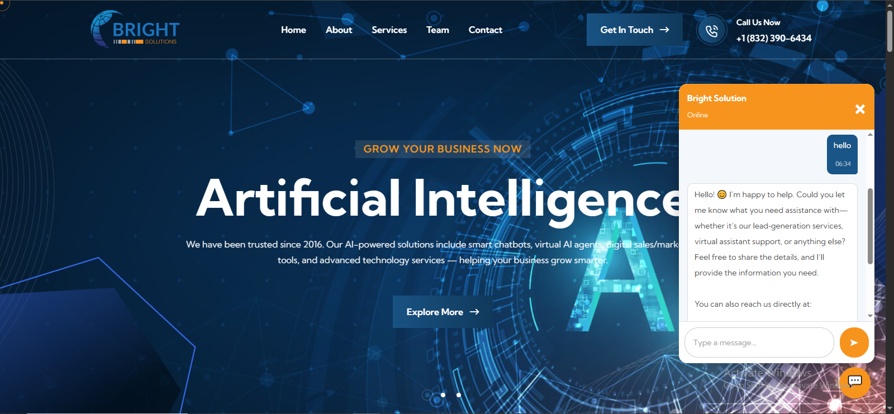

# Bright Solutions RAG Chatbot 🤖✨

Welcome to the **Bright Solutions RAG Chatbot** repository! This project showcases our customizable Retrieval-Augmented Generation (RAG) chatbot solution, designed to empower businesses, organizations, and firms with intelligent, AI-powered assistants. Whether you're looking to enhance customer support, provide instant answers from your company documents, or integrate a smart chatbot into your website, we've got you covered. 

As a leading BPO and AI solutions provider, **Bright Solutions** offers this as a **professional service** to clients worldwide. We build, customize, and deploy tailored chatbots using your documents, website content, or any relevant data sources. Simply provide us with your requirements, and we'll deliver a ready-to-integrate chatbot via API endpoints or iFrame tags. Deployable on platforms like Hugging Face Spaces, Render, or your preferred cloud provider—no hassle on your end! 🚀

  
*(Screenshot of our chatbot in action on the Bright Solutions website, providing friendly and helpful responses to visitors.)*

## Why Choose Our RAG Chatbot Service? 🌟

At Bright Solutions, we specialize in creating AI chatbots that are:
- **Accurate & Contextual**: Powered by RAG architecture, our bots retrieve relevant information from your data sources before generating responses, ensuring high accuracy and relevance.
- **Customizable**: Tailored to your brand's voice—confident, calm, friendly, and professional. We use emojis sparingly to keep interactions engaging without overwhelming users. 😊
- **Scalable & Secure**: Handles growing query volumes with in-memory caching, conversation memory, and robust error handling.
- **Easy Integration**: Get an API key or iFrame embed code to add the chatbot to your website in minutes.
- **Cost-Effective**: Leverage open-source tools and efficient models to keep operational costs low while delivering premium performance.

This repository serves as a **template and demonstration** of what we can build for you. If you're a client, reach out to us, and we'll handle everything from data ingestion to deployment!

## Key Features 🔑

- **Document & Website Scraping**: We ingest data from PDFs, websites, or other formats using advanced loaders (e.g., PyPDFLoader for documents or web scrapers for online content).
- **Intelligent Retrieval**: Uses FAISS vector store with MMR (Maximal Marginal Relevance) search for diverse, relevant results—pulling the best chunks from your data.
- **Conversational Memory**: Remembers chat history (up to 10 messages) for natural, context-aware conversations.
- **Custom Prompting**: Pre-configured prompts ensure responses align with your brand (e.g., polite redirection for off-topic questions).
- **Caching & Rate Limiting**: In-memory TTL cache reduces redundant queries, improving speed and efficiency.
- **Health Checks & Logging**: Structured JSON logging with emojis for easy monitoring; health endpoint to verify system status.
- **FastAPI Backend**: Secure, CORS-enabled API for seamless integration with frontends like React.
- **Async Support**: Handles queries asynchronously for better performance under load.

## How It Works ⚙️

Our RAG chatbot follows a streamlined pipeline to deliver smart responses:

1. **Data Ingestion** 📥: 
   - We start by loading your source materials. For example:
     - **PDF Documents**: Use PyPDFLoader to extract text from company profiles, manuals, or FAQs (as shown in this demo with `BrightSolutionCompanyProfile.pdf`).
     - **Website Scraping**: Optionally, we can scrape your website content using tools like BeautifulSoup or LangChain web loaders to build a knowledge base from dynamic pages.
     - **Other Sources**: Support for CSVs, databases, or APIs—whatever fits your needs!

2. **Text Splitting & Embedding** 📑:
   - Documents are split into manageable chunks (e.g., 600 characters with 200 overlap) using RecursiveCharacterTextSplitter.
   - Embeddings are generated with models like `BAAI/bge-small-en-v1.5` (CPU-friendly and efficient). These vectors represent your data semantically.

3. **Vector Store Setup** 🔍:
   - Chunks are indexed in an in-memory FAISS vector database for fast similarity searches. No persistent storage needed for lightweight deployments.

4. **Query Processing** 💬:
   - When a user asks a question (via API), the retriever fetches relevant chunks.
   - The LLM (e.g., Groq's `openai/gpt-oss-120b`) generates a response based on a custom prompt, incorporating context and chat history.
   - If the query is irrelevant, the bot politely redirects to your contact info (e.g., phone or email).

5. **Response Delivery** 📤:
   - Clean, emoji-enhanced replies are returned. Cached for repeat questions to boost speed.

This architecture ensures your chatbot is not just a generic AI but a **brand-aligned representative** that grows your business smarter! 

## Getting Started as a Client 👥

As this is a **service offering**, you don't need to set up anything yourself—we handle it all! Here's how to engage:

1. **Contact Us**: Reach out via phone (+1 (832) 390-6434 or +92 333-316-7749) or email (info@brightssolution.com) with your requirements.
2. **Provide Data**: Share your documents, website URLs, or data sources.
3. **Customization Discussion**: We'll discuss tweaks like LLM models, embeddings, or vector DBs.
4. **Deployment**: We deploy on Hugging Face, Render, or your platform and provide API/iFrame integration details.
5. **Go Live**: Embed the chatbot on your site and start engaging users!

If you're a developer exploring the code, follow the setup below.

## Installation & Setup (For Developers) 🛠️

1. **Clone the Repository**:
   ```
   git clone https://github.com/Brights-Solution/PlugnBot
   cd PlugnBot
   ```

2. **Install Dependencies**:
   - Ensure Python 3.10+ is installed.
   - Create a virtual environment: `python -m venv venv && source venv/bin/activate`
   - Install packages: `pip install -r requirements.txt` (Note: Add a `requirements.txt` with FastAPI, LangChain, HuggingFace, Groq, etc.)

3. **Set Environment Variables**:
   - Create a `.env` file:
     ```
     GROQ_API_KEY=your_groq_api_key
     PROFILE_PATH=path/to/your/document.pdf
     ```

4. **Run the Server**:
   ```
   python app.py
   ```
   - Access the API at `http://localhost:8000`.
   - Test with: `curl -X POST http://localhost:8000/chat -H "Content-Type: application/json" -d '{"query": "Tell me about your services"}'`

## Usage Examples 📝

- **API Query**: Send a POST to `/chat` with `{"query": "What AI services do you offer?"}` → Get a tailored response.
- **Health Check**: GET `/health` to confirm the bot is ready.
- **iFrame Integration**: Embed like `<iframe src="your-deployed-url/chatbot"></iframe>` (we provide this for clients).

## Customization Options 🎨

We tailor everything to your needs for **more accurate, high-level responses**:
- **Change LLM**: Swap Groq for OpenAI, Anthropic, or others based on speed/cost/accuracy.
- **Embedding Models**: Upgrade to larger models (e.g., `sentence-transformers/all-MiniLM-L6-v2`) for better semantic understanding.
- **Vector Databases**: Switch to Pinecone, Weaviate, or Chroma for persistent, scalable storage if your data grows.
- **Advanced Features**: Add multi-modal support (images/videos), fine-tuning, or integrations with CRMs like Salesforce.
- **Branding**: Adjust prompts, tones, or add custom redirects.

Just let us know your preferences during our consultation!

## Contributing & Support 🤝

This repo is for demonstration. For custom builds or issues, contact us directly. We're here to help your business grow with AI! 

- **Phone**: +1 (832) 390-6434 | +92 333-316-7749
- **Email**: info@brightssolution.com
- **Website**: [brightssolution.com](https://brightssolution.com)

Thank you for exploring Bright Solutions RAG Chatbot. Let's build something amazing together! 🌐🚀
